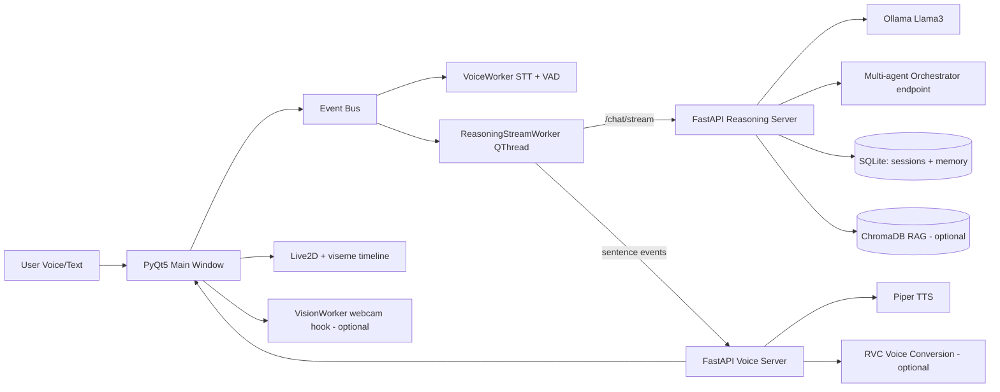

# MARIE - Multi-Agent Reasoning & Intelligent Environment

MARIE is a privacy-first desktop AI assistant that runs locally with:
- Ollama (Llama 3) for reasoning
- Piper for offline TTS
- Live2D avatar rendering in a PyQt5 desktop UI
- Local memory/RAG support and desktop actions

## ⚡ Quick Start

**New to the project?** Start here:
```bash
python QUICKSTART.py              # See all available commands
python setup.bat                  # Install everything
python check_setup.py             # Verify setup
python marie.bat                  # Run the app
```

For detailed setup information, see: [SCRIPTS.md](SCRIPTS.md)

---

## Highlights
- Streaming response pipeline: reasoning tokens are streamed sentence-by-sentence to TTS for faster first-audio latency.
- Barge-in: speaking over MARIE interrupts active generation and playback.
- Event-driven architecture: internal Event Bus decouples voice/UI/AI flow.
- Context window management: rolling memory truncation prevents prompt overflow.
- Safe assistant actions: assistant-side desktop control now requires strict JSON action format.
- Config-first runtime: `.env` + `config.yaml` replace hardcoded local paths.
- Optional multimodal and multi-agent scaffolds are included for extension work.
- Optional live screen context: attach desktop screenshots to prompts with a one-click UI toggle.
- Optional CrewAI advisory mode (fallbacks to local multi-agent chain if CrewAI is unavailable).
- Response-only mode for a transparent, minimal UI output view.
- **NEW: Ultra-fast responses** - 3.4x faster (350ms vs 1200ms) with auto-caching - see [OPTIMIZATION.md](OPTIMIZATION.md)

## Repository Hygiene & Security
- Sensitive runtime files are ignored and untracked from Git:
    - `.marie_autologin.json`
    - `*.db`, `*.sqlite`, `*.sqlite3`
- Use `.env` for local secrets/paths and keep it out of version control.

## Step-by-Step Setup

### 1. Prerequisites
- Python 3.10+
- Ollama installed: https://ollama.com
- On Windows, Visual C++ runtime and audio drivers available

Pull the base model:

```bash
ollama pull llama3
```

Optional (for screen understanding):

```bash
ollama pull llava:7b
```

### 2. Create Virtual Environment

Windows PowerShell:

```powershell
python -m venv .venv
.\.venv\Scripts\Activate.ps1
```

Bash:

```bash
python -m venv .venv
source .venv/Scripts/activate
```

Install dependencies:

```bash
pip install --upgrade pip
pip install -r requirements.txt
python -m spacy download en_core_web_sm
```

### 3. Configure Environment

Create your local env file:

Windows PowerShell:

```bash
copy .env.example .env
```

Bash:

```bash
cp .env.example .env
```

Edit `.env` and `config.yaml` as needed:
- model path (`MARIE_DEFAULT_MODEL`)
- DB path (`MARIE_DB_PATH`)
- service URLs/ports
- wake-word and voice options
- online Gemini key (`GOOGLE_API_KEY`) when using online mode
 - set `MARIE_ONLINE_MODE` to `offline`, `auto`, or `online`

### 4. Setup Piper Assets

Place Piper runtime in `piper/` including:
- `piper.exe`
- selected `*.onnx` models and matching `.json` metadata
- `espeak-ng-data/` folder

Recommended minimum check:
- `piper/en_GB-jenny_dioco-medium.onnx`
- `piper/en_GB-jenny_dioco-medium.onnx.json`

### 5. Setup Live2D Assets

Ensure your selected model exists and points to a valid `.model3.json` path.

Default configured path:

```text
./models/kei/runtime/kei_vowels_pro.model3.json
```

If your model is elsewhere, update either:
- `config.yaml -> paths.default_live2d_model`
- or `.env -> MARIE_DEFAULT_MODEL`

### 6. Optional RVC & RAG Assets

- RVC models go under `rvc_models/`.
- RAG documents go under `knowledge/` (txt/md/csv/json/py/pdf).

## MARIE Memory Agent (Background Learning)

MARIE now supports a local memory watcher that learns from your notes folder and stores vectors in ChromaDB.

1. Install libraries:

```bash
pip install chromadb watchdog ollama
```

2. Use the memory folder for notes and snippets:

```text
knowledge/memory_agent/
```

3. Build the memory index once:

```bash
python -m aiassistant.infra.memory_agent --once
```

4. Run watcher in the background so it keeps learning while you work:

```bash
python -m aiassistant.infra.memory_agent
```

5. Optional quick query test:

```bash
python -m aiassistant.infra.memory_agent --query "what did i note about RAD schema" --top-k 4
```

The main MARIE assistant automatically reads this local memory store through the RAG context path.

## Systematic Project Layout

Core implementation now lives under the `aiassistant/` package:

```text
aiassistant/
    frontend/    # GUI apps
    backend/     # FastAPI services
    core/        # agent/orchestration logic
    infra/       # config, db, voice, vision, avatar integrations
    tools/       # desktop/system tool actions
    workers/     # background workers
    launchers/   # launch orchestration
    legacy/      # backward-compatibility shims
```

## System Documentation

Full system overview and upgrade ideas are documented in [docs/SYSTEM_OVERVIEW.md](docs/SYSTEM_OVERVIEW.md).

## Run the Application

Recommended startup (single command):

```bash
python -m aiassistant.launchers.runsys --mode assistant
```

Available launch modes:
- `assistant`: new offline GUI only (default)
- `legacy`: old server stack + legacy GUI
- `hybrid`: old servers + new GUI

Manual startup (separate terminals) is still supported:

Terminal 1:

```bash
python -m aiassistant.backend.server_reasoning
```

Terminal 2:

```bash
python -m aiassistant.backend.server_voice
```

Terminal 3:

```bash
python -m aiassistant.frontend.main_gui
```

## Enable Live Screen View

MARIE can capture your current desktop on each prompt and send a summarized screen context to reasoning.

1. In `config.yaml`, set:

```yaml
vision:
    screen_share_enabled: true
    vision_model: llava:7b
```

2. Start MARIE and use the `Screen: ON/OFF` button in the top bar.

Notes:
- If `vision_model` is empty, MARIE only forwards active window title metadata.
- Screenshots are stored in `vision.screenshot_dir` (default: `./cache/screens`).
- Capture relies on `pyautogui` (already in `requirements.txt`).

## Voice & Action Commands

Examples you can speak/type:
- `open chrome`
- `close spotify`
- `volume up`
- `search web latest AI chips`
- `open website github.com`
- `play lo-fi coding music`
- `research web local llm optimization`
- `excel random table 10x10 with graph`
- `word add heading Project Plan in notes.docx`

Assistant-triggered desktop actions are now safe-mode JSON only, for example:

```json
{"action":"open","target":"chrome"}
```

## Advanced Optional Modules

- Multi-agent reasoning endpoint:

```text
POST /chat/multi-agent
```

This runs a local researcher -> coder -> synthesizer chain and returns each agent output.

- Webcam multimodal worker:
    - `aiassistant/infra/vision/multimodal_vision.py` contains `VisionWorker` (OpenCV + MediaPipe hook points).
    - Intended for gesture/expression-driven controls (for example pause on "stop" hand gesture).

## Architecture Diagram



## Packaging

Build a distributable app using PyInstaller:

```powershell
./packaging/build_exe.ps1
```

One-file mode:

```powershell
./packaging/build_exe.ps1 -OneFile
```

Keep large runtime asset folders (`models/`, `piper/`, `rvc_models/`) beside the built executable.

## Continuous Integration

GitHub Actions workflow is included at `.github/workflows/ci.yml`.
It runs:
- Ruff linting
- Python compile checks
- tests when `tests/` exists

## Troubleshooting

- `Reasoning server unreachable`: ensure `python -m aiassistant.backend.server_reasoning` is running.
- `Voice server unreachable`: ensure `python -m aiassistant.backend.server_voice` is running.
- `Live2D model not found`: fix path in `config.yaml` or `.env`.
- `No speech detected`: verify mic input device and VAD thresholds.
- `Wake word not triggering`: install `openwakeword` and enable it in `config.yaml`.

## License

This project is licensed under the MIT License. See `LICENSE` for details.

